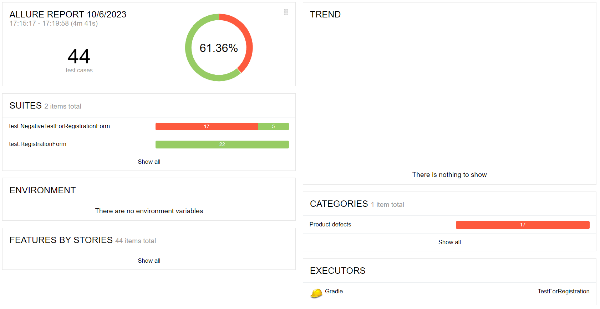
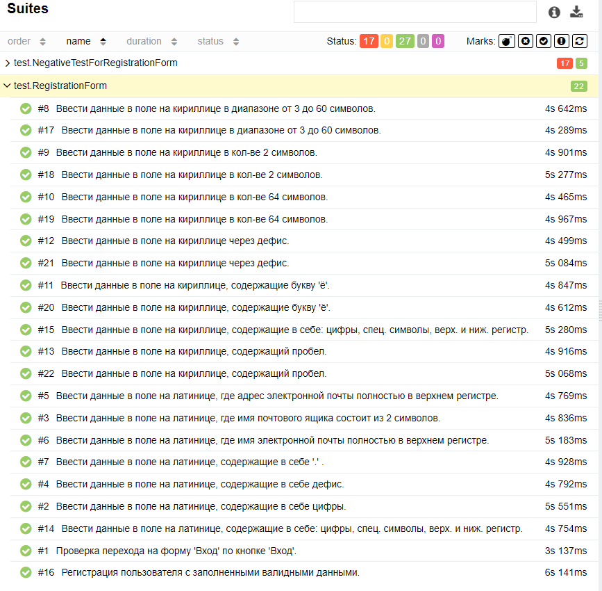
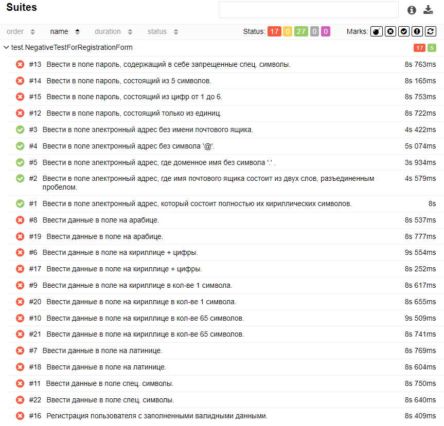

# Отчёт о проведённом тестировании
### Краткое описание
Было проведено автоматизированное тестирование на форму "Регистрация" на [сайте](https://tms.biacorp.ru/).
### Количество тест-кейсов
Общее количество тест-кейсов - 44:
* Позитивные тест-кейсы - 22, из них:
    - успешные - 22;
    - не успешные - 0;
* Негативные тест-кейсы - 22, из них:
    - успешные - 5;
    - не успешные - 17;

Процент успешных тестов - 61.36%, не успешных тестов - 38.63%.

### Общие рекомендации
Поработать над выводом оповещений об ошибках. Над логикой валидации не валидных значений и т.д.
