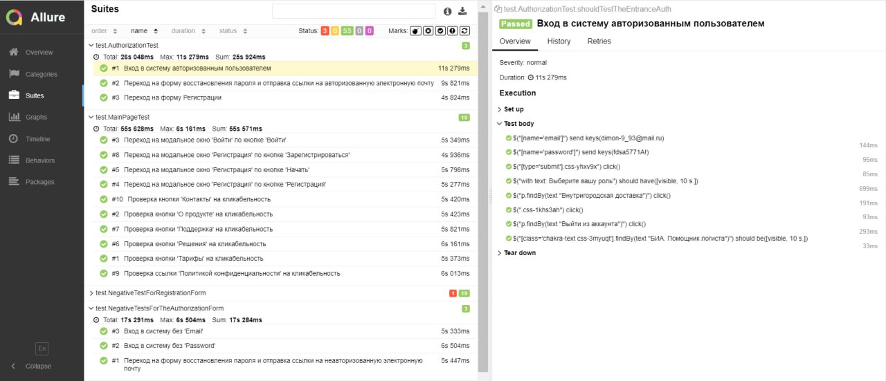
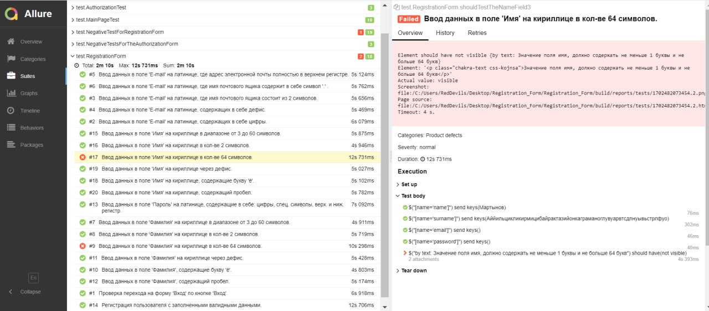

# Отчёт о проведённом автоматизированном тестировании 
### Краткое описание
Было проведено автоматизированное тестирование на формы "Регистрация" и "Войти", а также главную страницу [сайта](https://tms.biacorp.ru/).
### Количество автоматизированных тест-кейсов
Общее количество тест-кейсов - 56:
* Позитивные тест-кейсы - 33, из них:
    - успешные - 31;
    - не успешные - 2;
* Негативные тест-кейсы - 23, из них:
    - успешные - 22;
    - не успешные - 1;

Процент успешных тестов - 94.64%, не успешных тестов - 5.36%.
### Отчет Allure

### Общие рекомендации
Разработать требования к продукту. Провести анализ требований и его тестирование. Продолжать разрабатывать тестовую документацию, применяя техники тест-дизайна. У каждого выпускаемого продукта должна быть документация.
